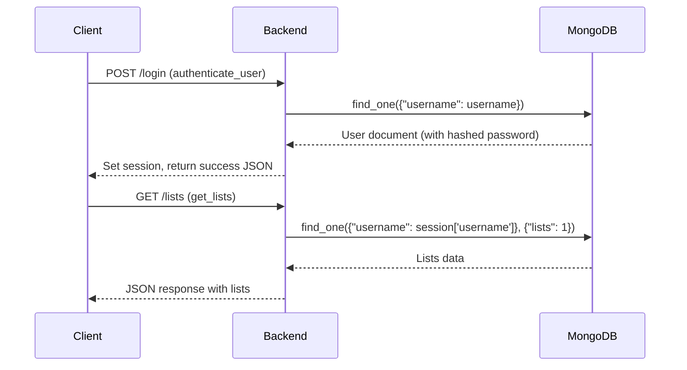

# Auth_DB_Microservice

This microservice provides a RESTful API for user authentication and management of custom movie lists using MongoDB. You can register users, authenticate, and perform CRUD operations on movie lists and movies within those lists.

---

## How to Start the Microservice

1. **Install dependencies**  
   From the `mongodb_service` directory, run:

   ```bash
   pip install -r requirements.txt
   ```

2. **Set up environment variables**  
   Create a `.env` file in the `mongodb_service` directory with the following variables:

   ```
   MONGO_URI=your_mongodb_connection_string
   SECRET_KEY=your_flask_secret_key
   DEBUG=True
   ```

   - `MONGO_URI`: Your MongoDB Atlas or local MongoDB connection string.
   - `SECRET_KEY`: Any random string for Flask session security.
   - `DEBUG`: Set to `True` for development.

3. **Start the backend server**  
   From the `mongodb_service/app` directory, run:
   ```bash
   python main.py
   ```
   By default, the service will run on `http://localhost:8000`.  
   If you want to use a different port, edit the last lines of `main.py`:
   ```python
   if __name__ == '__main__':
       app.run(debug=True, port=8000)
   ```

---

## How to REQUEST Data from the Microservice

All requests should be made to the running service’s base URL (e.g., `http://localhost:8000`).  
Use standard HTTP methods (`POST`, `GET`, `PUT`, `DELETE`) and send/receive JSON payloads.

### Example: Register a New User

**Request:**

```python
import requests

resp = requests.post(
    "http://localhost:8000/register",
    json={
        "username": "alice",
        "email": "alice@example.com",
        "password": "securepassword"
    }
)
print(resp.json())
```

---

## How to RECEIVE Data from the Microservice

Responses from the microservice are returned as JSON. You can access the data using the `.json()` method of the `requests` library.

### Example: Get All Movie Lists for a User (after logging in)

**Request:**

```python
import requests

session = requests.Session()
# First, log in to establish a session
session.post(
    "http://localhost:8000/login",
    json={"username": "alice", "password": "securepassword"}
)
# Now, get the lists
resp = session.get("http://localhost:8000/lists")
lists = resp.json()
print(lists)
```

---

## API Endpoints Overview

- `POST /register` — Register a new user
- `POST /login` — Log in as a user
- `POST /logout` — Log out the current user
- `GET /lists` — Get all lists for the signed-in user
- `POST /lists` — Create a new list
- `PUT /lists/{old_name}/rename` — Rename a list
- `DELETE /lists/{name}` — Delete a list
- `POST /lists/{list_name}/movies` — Add a movie to a list
- `DELETE /lists/{list_name}/movies/{movie_id}` — Remove a movie from a list
- `PUT /lists/{list_name}/movies/{movie_id}/rating` — Update a movie's rating in a list

All endpoints expect and return JSON.

---

## Notes

- You must handle authentication (login) and session management in your own code.
- Always check the response status code and handle errors as needed.
- For endpoints that require authentication, use a persistent session (e.g., `requests.Session()`).

---

## UML Sequence Diagram: Requesting and Receiving Data

Below is a UML sequence diagram illustrating the flow for a typical authenticated request (e.g., getting a user's movie lists), **including function names**:



**Explanation:**

- The client first authenticates by sending credentials to the backend (`authenticate_user`).
- The backend verifies credentials with MongoDB, sets a session, and returns a success response.
- For subsequent requests (like getting lists), the client sends the session cookie.
- The backend checks the session, calls `get_lists`, queries MongoDB for the requested data, and returns the result as JSON.

---
